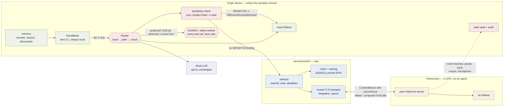

# ADR 0002 — A mesh of Alex's own machines: one turn, one machine, chosen by warmth

*Status: proposed, 2026-09-06. Extends the deployment shapes and trust boundaries in
[docs/architecture/overview.md](../architecture/overview.md). No code exists yet; the
overview is updated in step 9, when it does.*

## Context

A.R.S runs as one process on one laptop (`services/gateway/src/ars_gateway/app.py`), with
Ollama serving `qwen3:14b` locally. Alex owns more hardware than that — a desktop, a
phone, possibly a home node — and wants them to help.

The instinct is "share the compute load". Before designing that, it is worth being precise
about how much load there is to share, because this project already spent its best idea on
that problem.

**The tier ladder ate most of the value a mesh could deliver.** A turn climbs
`RECALL` (~1 ms, no model) → `DOCUMENTS` (~10-20 ms, CPU) → `LOCAL` (the GPU) → `CLOUD`,
and stops at the first rung that answers. Only tier 2 is expensive, and only tier 2 has
anything a second machine could do. So the mesh's addressable share of turns is exactly
`gpu_turns / total_turns`, a number the gateway already computes and shows:
`_tier_stats()` reports `gpu_avoided_pct` on `/api/status`. **Alex can read the ceiling on
this ADR's value off his own status endpoint before a line of it is written.** If the
ladder is avoiding the GPU on 70% of turns, the mesh can improve at most the other 30%.

The second thing that constrains the design is measured and in the tree already:

| Fact | Source | Consequence for the mesh |
|---|---|---|
| Local model, warm prefix: ~120 ms to first token | `backends/ollama.py:212` | A warm local GPU cannot be beaten across a network. |
| Local model, cold system prefix: ~1.1 s to first token | same | A warm peer beats a cold local model by ~900 ms. |
| `keep_alive = "10m"` | `backends/ollama.py:149` | After ten idle minutes the weights are evicted and the next turn pays a multi-second load. This is the window the mesh exists to cover. |
| ASR on Apple Silicon: 121 ms (mlx-whisper) vs 8.2 s (faster-whisper on CPU) | `packages/core/src/ars_core/config.py` | On a capable device ASR is already cheap; offloading it is a loss. On a device without a GPU path it is the whole game. |
| Embedding warm-up: ~7 s on first use | `app.py`, the `memory.recall("warm")` call | Background work has a real cost worth moving. |
| Audio is 16 kHz mono int16 = 32 kB/s | `packages/protocol/audio.py` | A 5 s utterance is 160 kB — ~10× a whole tier-2 prompt. Audio is the expensive thing to move; text is not. |

And the third: **`Sensitivity.SENSITIVE` never leaves the device**, and **deletion must
actually delete** (CLAUDE.md non-negotiables 4 and 7). A peer is another machine. Every
byte sent to it is a byte in a second place, held in a second KV cache, possibly in a
second server's logs, on a device that may be a phone in a pocket.

**The driving constraint is therefore not throughput. It is that distributing compute
normally means distributing data, and A.R.S's privacy claim is anchored to the data being
in one place.** The design below is shaped entirely by refusing to move the corpus.

### What is actually distributable

Ruthlessly, because this is where the value is decided.

| Idea | Verdict | Why |
|---|---|---|
| **Route a tier-2 turn to a peer that already has the model warm** | **Worth it — the whole ADR** | The prompt is ~15 kB (884-1184 token system prompt + up to 8 memory blocks of ≤1100 chars). Moving it costs a LAN round trip; the alternative can cost seconds of weight loading. Wins when local is cold, busy, or down. |
| **Answer at all when the local backend is down** | **Worth it, same mechanism** | Today `startup_note` says "local model unreachable" and the user gets tier 0/1 or nothing. This is the difference between an answer and an apology, and it is what Alex will actually feel. |
| **Serve the phone from a home node** | **Worth it, and half-designed already** | "Home node + phone" is an existing deployment shape in the overview. The mesh contributes discovery and authentication so it stops being a hand-configured hostname. |
| **Batch background work onto an idle, plugged-in peer** | **Worth it, but last** | Re-embedding after a model change, document ingestion, evaluation runs. Minutes of wall clock, zero latency risk. But it moves document *text*, which is the one thing this design otherwise refuses to move — so it needs its own consent, and it ships third. |
| **ASR on one device, reasoning on another, for a capable device** | **Fantasy** | ASR is 121 ms locally. Sending 160 kB of audio to save part of a 250 ms row is a loss, unless the audio streams *during* speech and overlaps the 700 ms silence window. Store-and-forward is a guaranteed budget miss. Only the phone shape justifies it. |
| **Shard the embedding / document index across peers** | **Fantasy at this scale** | One person's corpus is 10⁴-10⁵ chunks; 50k × 384 float32 is 76 MB and brute-force search is tens of milliseconds. Halving 20 ms while adding a 10 ms hop and a consistency problem is not an optimisation, it is a distributed system built for fun. |
| **Split one LLM turn across machines (tensor/pipeline parallel)** | **Fantasy, and harmful** | See "Alternatives rejected". |
| **Fan a turn out to every peer and take the fastest** | **Refused** | Doubles the prompt's exposure, produces two divergent answers, and burns two GPUs for one question. One turn, one machine. |

The honest summary: **the mesh is not a speed-up. It is an availability and cold-start
mechanism that occasionally reads as a speed-up.** Framing it as "faster" would set an
expectation the physics does not support, and the latency table below says so explicitly.

## Decision

The dashed line is the one to read: **nothing on the peer side ever reaches grants, the
OAuth vault, the memory database or the microphone.** A peer receives one turn's context
and returns text and proposals.

### 1. A peer is a GPU, not an agent

The only thing a peer ever does is run model inference on context it was handed and stream
the result back. It does not hold grants, credentials, the OAuth vault, the audit log, or
the memory database. It does not execute tool calls. A `ToolCall` produced by a peer's
model comes back over the wire and is evaluated by `GuardEngine.evaluate` **on the
originating device**, with the origin's taint state, exactly as it is today in
`services/compute/turn.py`.

This is the load-bearing decision. It means a fully compromised peer can do two things:
return wrong text, and propose a tool call that the origin's guard then judges on its own
authority. It cannot act.

It also means the existing "never auto-retry an effectful thing" property survives for
free: peers have no effects to retry.

### 2. The mesh is not a new tier. It is a choice of which machine runs tier 2

`Tier` stays four rungs. Tiers 0 and 1 always execute on the device that received the
question — they cost 1-20 ms, and any remote path costs more than the tier does. Tier 3
is unchanged. Only tier 2 gains a device choice, recorded as `served_by` on the tier
event so the UI can show which machine spent its GPU.

### 3. A peer is off-device, and the existing privacy check already knows what to do

`LlmBackend.runs_locally` means "can user data leave this device when this backend is
used". For a peer that answer is **False**. `Router._guard_cloud` already raises on any
backend with `runs_locally=False` while a SENSITIVE finding is in the context — declared
or detected, checked twice (`backends/router.py:234`). Wiring a peer in as a
`runs_locally=False` backend therefore makes SENSITIVE refusal automatic, with no new
privacy code and no second implementation of the rule to keep in sync.

Two renames follow, and they are not cosmetic:

- `CloudRoutingRefused` → `OffDeviceRoutingRefused` (alias kept for one release). A user
  told "refused: cloud" when A.R.S declined to send their medical note to their own
  desktop has been told something false.
- `Router._guard_cloud` → `_guard_off_device`, called for the peer slot too.

`Router` gains a third slot, `peers`, and the order is **local → peer → cloud**. A peer is
never reachable through the `cloud` slot: that slot carries a different policy, a different
provider, and a different sentence to the user.

`Router.runs_locally` returns False as soon as a peer is wired, on the same reasoning its
docstring already gives for cloud. A deployment that wants the unconditional privacy claim
runs with no peers, which is the default.

### 4. Identity, pairing, discovery — in that order of importance

The threat is stated plainly because it is easy to underrate: **an unauthenticated peer
that can answer questions can put words in A.R.S's mouth, and those words are spoken
aloud and then learned.** `TieredBrain.learn_answer` stores model-tier answers as
`MemoryKind.FACT` at `TrustLevel.SYSTEM`, and tier 0 serves them back at ~1 ms for months.
A rogue peer is not a wrong-answer channel, it is a persistent memory-poisoning channel.

- **Identity.** Every device generates an Ed25519 keypair on first boot. The private key
  lives in the OS keystore (macOS Keychain, Android Keystore) — never in `var/`, never in
  the repo. `PeerId` is `pr_` + the first 20 hex of SHA-256 over the SPKI, so it has the
  same shape as every other ID in the protocol and reads the same in logs. It is derived,
  not random: two devices cannot collide on an identity by accident or on purpose.
- **Pairing.** A six-digit code with a 120 s single-use lifetime is shown on device A and
  typed on device B. The two exchange SPKIs over the resulting channel and **both display
  a short fingerprint that the user confirms matches**. The user's eyes are the
  out-of-band channel; that is what defeats an on-path attacker without adding a PAKE.
  (Whether a PAKE — SPAKE2 — should replace the fingerprint confirmation is a call for
  `security-engineer`.)
- **Transport.** Mutual TLS 1.3 with SPKI pinned to the roster. No CA, no web PKI, no
  trust-on-first-use at connect time. An unpaired peer is refused before its bytes are
  parsed as anything other than a handshake.
- **Remote peers.** A peer outside the LAN is reached over WireGuard or Tailscale. A.R.S
  does not implement NAT traversal, relays, ICE or STUN. It still performs its own mutual
  authentication over that link, because the network is never the authenticator.
- **Discovery.** mDNS `_ars._tcp.local`, advertising peer id, device class and protocol
  version — nothing else. **Discovery is not authorisation.** A discovered peer is a
  candidate for pairing and nothing more. Discovery ships *after* pairing and transport,
  because it is a convenience and they are the capability.
- **Revocation.** Manual, per device, on a roster of four. There is no distributed
  revocation protocol for four machines. Memory records a peer produced carry
  `provenance.uri = ars-peer://<peer_id>/<turn_id>`, and
  `SqliteMemoryStore.records_by_uri_prefix` already exists — so "forget everything that
  machine told me" is a deletion that works today, tested against non-negotiable 7.
- **Protocol version.** Peers must agree on `PROTOCOL_VERSION` major and minor. A mismatch
  is a refusal, never a degradation: two of Alex's own machines silently disagreeing about
  a contract produces wrong answers rather than errors, which is worse.

### 5. The wire protocol lives in `packages/protocol`

New module `packages/protocol/src/ars_protocol/peer.py`, exported from `__init__.py`,
`PROTOCOL_VERSION` → `0.2.0`. It **reuses** `ContentBlock`, `Provenance`, `ToolSpec`,
`ToolCall`, `Language`, `Device`, `Sensitivity` and `TurnId`/`SessionId` — nothing is
redefined, per non-negotiable 1.

| Type | Purpose | Notable fields |
|---|---|---|
| `PeerId` | annotated str, `^pr_[a-f0-9]{20}$` | derived from the public key |
| `PeerIdentity` | who a device is | `peer_id`, `display_name`, `device: Device`, `public_key_spki`, `protocol_version` |
| `PeerHello` / `PeerWelcome` | handshake and version negotiation | `identity`, `nonce` |
| `PairingOffer` / `PairingAccept` / `PairingConfirmed` | code-based pairing | `fingerprint` (shown to the user), `expires_at_ms`. **Never carries the code itself.** |
| `PeerDataClass` | what a peer may receive | `CONTEXT_ONLY` (default), `BATCH_OK`. **There is deliberately no `SENSITIVE_OK`** — for the same reason `GuardConfig` has no setting that disables the guard while keeping access. |
| `PeerRosterEntry` | a paired peer, persisted | `identity`, `paired_at_ms`, `data_class`, `revoked_at_ms` |
| `PeerModelState` | what this peer can serve *now* | `model`, `backend`, `resident: bool`, `warm_prefixes: tuple[Language, ...]`, `measured_ttft_ms` |
| `PeerLoad` | whether it should | `gpu_busy`, `queue_depth`, `on_ac_power`, `battery_pct`, `thermal_pressure` |
| `PeerHeartbeat` | liveness, 1 Hz | `identity`, `models`, `load`, `seq`, `at_ms` |
| `InferenceRequest` | the turn | `turn_id`, `session_id`, `nonce`, `system`, `context: tuple[ContentBlock, ...]`, `tools`, `language`, `reasoning`, `max_sensitivity: Sensitivity`, `deadline_ms` |
| `InferenceDelta` | streamed reply | `turn_id`, `seq`, `text \| tool_call` |
| `InferenceKeepalive` | proof of life mid-stream | `turn_id`, `seq` |
| `InferenceDone` | end + telemetry | `ttft_ms`, `input_tokens`, `output_tokens`, `model`, `backend` |
| `InferenceError` / `InferenceCancel` | failure and barge-in | `code`, `retryable` / `reason` |
| `PeerRefusal` | a peer saying no, with a reason | `PROTOCOL_VERSION`, `NOT_PAIRED`, `SENSITIVITY`, `OVERLOADED`, `MODEL_MISSING`, `ON_BATTERY` |
| `BatchJob` / `BatchJobResult` | increment 3 only | `job_id`, `kind: EMBED \| INGEST \| EVAL`, `embedding_model_id`, `dim` |

Two rules about this wire that are not negotiable:

1. **Context crosses as `ContentBlock`s with provenance intact — never flattened to a
   prompt string.** Flattening loses `TrustLevel.EXTERNAL`, and the peer's backend would
   then render attacker-controlled text outside its quarantine frame. A peer whose
   protocol version cannot carry provenance is refused, not downgraded.
2. **`InferenceRequest.max_sensitivity` is declared, and the peer checks it independently
   and may refuse.** This mirrors the taint backstop in `turn.py`: two layers, written to
   be checked separately, both have to agree before private text is processed.

`guard.py` gains one value: `SourceKind.PEER_DEVICE`.

### 6. What may cross a device boundary, and what may never

| May cross to a paired, authenticated peer | Never crosses, to any peer, under any configuration |
|---|---|
| The assembled turn context — system prompt, the user's transcript, `USER_DATA` memory blocks, `EXTERNAL` blocks with provenance — **only when no SENSITIVE finding, declared or detected** | Any block with a SENSITIVE finding. Enforced by a raise, not a preference |
| `ToolSpec` definitions: names, descriptions, schemas | OAuth tokens, API keys, the grant store, the audit log, guard policy state |
| Reply deltas and proposed `ToolCall`s coming back | The memory database, the vector index, or the document corpus **as a corpus** |
| Heartbeats: model warmth, load, power state. Not questions, not content | Raw microphone audio — except in the explicit phone→node ASR shape, and never before wakeword |
| Chunk text of a document Alex explicitly enrolled for batch offload, to a `BATCH_OK` peer only | Anything at all to an unpaired peer |

**"Alex's documents must not be replicated to a peer just because it is idle"** is
enforced structurally: there is no code path that sends a corpus. Data moves as *this
turn's context* or as *an explicitly enrolled batch job*, and nothing else exists to send.

The guard's involvement, precisely:

- Routing a turn to a peer is **not** a `GuardQuery`. It is a router policy decision, the
  same class of decision as cloud routing, and the guard is budgeted at 0 ms with no I/O
  on the hot path — putting a network-shaped decision behind it would break that.
- Every off-device routing decision **is** written to the audit log, in `AuditRecord`
  shape, with the peer id and the reason — never the context. Today `RoutingDecision`
  lives only in turn stats, which means the question "what left this machine, and to
  where" has no answer even for cloud turns. **That is a pre-existing gap and it belongs
  to `security-engineer`.**
- A tainted turn may still be served by a peer: the peer is a GPU, the taint stays with
  the turn on the origin, and the backstop in `turn.py` runs where it always did.

## Latency budget

The existing budget (1400 ms, speech end → first audio, ADR 0001) and where the network
hop lands.

| Stage | Local (p95) | Peer-served (p95) | Owner |
|---|---:|---:|---|
| Endpoint confirmation (700 ms silence + detection) | 750 ms | 750 ms | voice-engineer |
| ASR final | 250 ms | 250 ms — stays where the microphone is | voice-engineer |
| Context assembly + memory recall | 80 ms | 80 ms — stays where the memory is | backend / ml |
| Peer selection (in-memory roster, no I/O) | — | 1 ms | backend-engineer |
| **`PEER_HOP` — serialise ~15 kB, round trip, deserialise** | — | **60 ms** | backend-engineer |
| LLM first token | 200 ms | 200 ms — a peer meets the *same* row | ml-engineer |
| TTS time-to-first-audio | 120 ms | 120 ms — audio plays where the user is | voice-engineer |
| **Total** | **1400 ms** | **1460 ms (`TOTAL_PEER`)** | system-architect |

`PEER_HOP` is budgeted at 60 ms and is **assumed, not measured** — it stands in for
~2-4 ms p50 / 8-15 ms p95 of Wi-Fi 6 round trip on a quiet AP, plus serialisation, plus
headroom for jitter. It is written down so that
`tests/load/test_mesh_latency_budget.py` can replace it with a number. A phone in Wi-Fi
power save will not meet it (radio wake alone can cost 40-100 ms), and a peer over
WireGuard across the internet certainly will not (20-60 ms RTT before anything is sent).
Those peers are for typed turns and batch work, not for the spoken path.

`TOTAL_PEER` is deliberately a **separate, worse budget row** rather than a widening of
`TOTAL`. If the mesh were allowed to relax the main number, a regression on the local path
would hide behind it forever.

### When the mesh is a loss

The crossover rule, stated so it can be implemented and argued with:

> Route to a peer only if `peer_ttft_p95 + PEER_HOP + margin < local_ttft_estimate`.

| Local state | `local_ttft_estimate` | Peer path | Verdict |
|---|---:|---:|---|
| Model warm, GPU idle | ~120-200 ms | ~260 ms | **Mesh loses.** Always local. This is the common case on the laptop. |
| Weights resident, system prefix cold (first turn in a language after restart) | ~1100 ms (measured) | ~260 ms | Mesh wins ~840 ms |
| Weights evicted after `keep_alive` expiry | seconds (9 GB off SSD, plus prefill) | ~260 ms | Mesh wins seconds |
| GPU busy with another turn | queued | ~260 ms | Mesh wins |
| Ollama down | ∞ | ~260 ms | Mesh is the difference between an answer and an apology |
| Phone, no 14B model at all | n/a | ~300 ms + WAN | Mesh is the entire feature |

So: **on the laptop, in steady state, the mesh does nothing, and it must be built to know
that.** Its value there is cold-start and availability. Its value on the phone is
everything. Any presentation of this feature that says "your devices make A.R.S faster" is
overselling it.

## Failure

Peers vanish. Laptops sleep mid-token, phones lose signal, and TCP will happily wait 30+
seconds before admitting it. **Application-level liveness is mandatory; transport liveness
is not liveness.**

| Deadline | Value | Behaviour on breach |
|---|---:|---|
| Connect | 250 ms (LAN) | Peer is asleep. Drop it from the candidate set, go local. |
| First delta | `peer_ttft_p95 × 1.5 + 100 ms`, hard cap **800 ms** spoken / **3 s** typed | Abandon the peer, run locally. |
| Inter-delta silence | 500 ms without a delta or `InferenceKeepalive`; 2 missed = dead | See the two cases below. |
| Heartbeat | 1 Hz; 2 missed = out of the roster's live set | No effect on a turn in flight; removes the peer from future selection. |

**The user must never wait longer because of a peer than they would have waited locally.**
Two mechanisms:

1. **Selection is predictive, not optimistic.** A peer is chosen only when the inequality
   above holds using its *advertised measured* TTFT and the *observed* hop time — never
   because it is merely available.
2. **Hedging, where it is free.** When the local model is resident and the GPU is idle,
   local prefill starts in parallel with the peer request and the first token to arrive
   wins; the loser is cancelled. This is the same speculative pattern ADR 0001 established
   for ASR decode during the silence window: spend idle compute to bound the worst case.
   When the weights are *not* resident — precisely the case where the peer wins big —
   there is no cheap hedge, so the worst case is honestly `first-delta deadline + local
   cold start`. That is why the deadline is 800 ms on the spoken path and not 3 s.

**Mid-stream loss splits on one question: has the user heard anything yet?**

- **Before first audio:** abandon silently, re-run locally from the top. The user sees
  nothing but a different `served_by` on the tier badge. This is the common case and it
  must be invisible.
- **After first audio:** never silently restart. The user has already heard half a
  sentence, and a second, different answer arriving on top of it is worse than the
  failure. Finish the buffered sentence, speak a bounded recovery line — in EN and RO,
  written by a person, not the model — and re-run locally with the peer's partial text
  included as an `ASSISTANT`-trust prefix so the continuation is coherent.
- **Nothing partial is learned.** `Answer.can_learn` is already False on an errored turn;
  a peer-abandoned turn takes the same path, for the same reason: caching "my other
  machine went away" as the permanent answer to a question is the worst outcome available.

**Barge-in does not wait for the network.** `InferenceCancel` is fire-and-forget. The
local state change and the speaker stop happen immediately; the `BARGE_IN_CANCEL`
measurement must not acquire a network dependency. A peer that never receives the cancel
wastes its own GPU, which is its problem.

## What we will not build

| Not building | Why |
|---|---|
| **Tensor / pipeline parallelism across the LAN** (llama.cpp RPC and similar) | Requires a round trip per split point per token. At 3-8 ms of LAN RTT that caps generation in the low tens of tokens per second, and it converts two independent machines into one machine with two failure domains: both must be awake for either to answer. It trades the property Alex actually wants — resilience — for throughput he will not get. |
| **Cross-network speculative decoding** (draft on the phone, verify on the desktop) | The verify step needs a round trip per draft window. This is a real technique at sub-0.1 ms datacenter RTT; on Wi-Fi it loses to simply running the big model on the desktop, and the phone's draft model is the weaker one anyway. |
| **Replicating the memory DB or document corpus to peers** | Breaks non-negotiable 7 outright: every replica is a place a deleted record survives. It also makes the privacy claim only as strong as the least-secure device in the mesh — which is the phone. Compute goes to the data or the data goes as one turn's context; the corpus does not move. |
| **A distributed / sharded vector index** | 10⁴-10⁵ chunks. Local brute force is tens of milliseconds. Sharding buys single-digit milliseconds and costs a hop plus an index-consistency problem, on top of the one `memory_meta` already solves for embedding-model mismatch. |
| **Peers that execute tool calls or hold grants** | A second copy of the attack surface with no audit log and no consent UI. Peers are GPUs. |
| **Fan-out to N peers, take the fastest** | Multiplies the exposure of the prompt, burns two GPUs per question, and produces divergent answers for one turn. |
| **A cluster scheduler (Ray, Celery, Kubernetes)** | Four devices. The roster is a dict and the scheduler is one inequality and a deadline. |
| **Our own NAT traversal, relays or discovery service** | WireGuard and Tailscale exist and are boring. Writing ICE is a project, not a feature. |
| **A "mesh" tier in the tier ladder** | The ladder answers "how much machine is this question worth". Which machine runs tier 2 is a different question and must not be conflated with it, or every threshold in `brain.py` becomes topology-dependent. |
| **A `SENSITIVE_OK` peer data class, or a "trusted device group" that exempts SENSITIVE** | The moment such a setting exists, the guarantee is a preference. There is no version of this that survives a phone being lost. |
| **Cross-device session sync / CRDT-merged conversation state** | A real feature and a different ADR. It is multi-device UX, not compute sharing, and bundling it here would smuggle a replication design past the corpus rule above. |

## Consequences

- **Good:** A.R.S answers when the laptop's Ollama is down. Cold-start turns get seconds
  faster. The phone gets a real model. Background re-embedding stops costing Alex his
  laptop for twenty minutes.
- **Good:** SENSITIVE refusal needs no new code — the peer is `runs_locally=False` and the
  existing raise covers it. One rule, one implementation.
- **Cost:** A second network-facing listener on every device, mutual TLS, a pairing flow,
  a keystore integration per platform. This is the largest single addition to A.R.S's
  attack surface so far. **`security-engineer` must review steps 2, 3 and 4 before they
  merge**, specifically: the pairing handshake and fingerprint confirmation (is the
  user's eye enough, or is SPAKE2 required?), private key storage per platform, replay
  and turn-id binding, and the off-device audit gap named above.
- **Cost:** the latency story becomes conditional. `TOTAL` and `TOTAL_PEER` are two
  budgets, and every report must say which one a turn was measured against.
- **Cost:** `CloudRoutingRefused` is renamed. It is referenced in tests and in
  `errors.py`; the alias covers one release.
- **Honest limit:** on a laptop that is in use all day, with `keep_alive = 10m`, the model
  is warm most of the time and the mesh will report that it declined to use a peer on the
  large majority of turns. That is the design working, and the UI should say so rather
  than hide it.

## First increment — "the desktop answers when the laptop cannot"

Small enough to ship, and it proves every hard part except discovery.

**Scope:** two devices on the LAN. Peer address configured explicitly (`ARS_PEERS`), no
mDNS. Pairing by code with fingerprint confirmation. Mutual TLS with pinned SPKI.
`PeerLlmBackend` implementing `LlmBackend` with `runs_locally = False`, in the `Router`'s
new `peers` slot. **Used only when the local backend is unreachable or the local model is
not resident** — the two cases where the peer is unambiguously faster, which is why even
spoken turns may use it. No hedging, no ASR offload, no batch jobs, no discovery.

**Proven by:**

1. Stop Ollama locally; a typed and a spoken turn both still answer, with
   `served_by = <peer>` on the tier event and the reply stored with
   `ars-peer://<peer_id>/…` provenance.
2. Delete that peer's contributions by uri prefix; assert the records and their embeddings
   are gone (non-negotiable 7).
3. A context with a SENSITIVE finding raises `OffDeviceRoutingRefused` and never opens a
   socket. Asserted with a mock transport that fails the test if it is called at all.
4. A peer that stops sending mid-stream, before first audio, falls back within the 800 ms
   deadline and the answer still arrives.
5. `tests/load/test_mesh_latency_budget.py` measures `PEER_HOP` on the real LAN and
   replaces the assumed 60 ms with a number.
6. EN and RO recovery lines, reviewed, in both languages (non-negotiable 5).

### Implementation order

| # | Step | Owner |
|---|---|---|
| 1 | `packages/protocol/peer.py`, `SourceKind.PEER_DEVICE`, `PROTOCOL_VERSION` → 0.2.0 | backend-engineer, contract approved by system-architect |
| 2 | Device identity + per-platform keystore, pairing flow, roster persistence (`services/mesh/`) | security-engineer owns, backend-engineer implements — **security review required** |
| 3 | Transport: mutual TLS server + client, keepalive, deadlines | backend-engineer — **security review required** |
| 4 | `services/compute/backends/peer.py`; `Router` `peers` slot; `_guard_cloud` → `_guard_off_device`; `CloudRoutingRefused` → `OffDeviceRoutingRefused` | backend-engineer, reviewed by system-architect — **security review required** |
| 5 | Selection policy, deadlines, fallback, mid-stream recovery (`services/mesh/selector.py`) | backend-engineer |
| 6 | Gateway wiring: `served_by` on the tier event, peers on `/api/status`, off-device routing written to the audit log | backend-engineer + security-engineer |
| 7 | UI: which machine answered, pairing screen, EN/RO strings | frontend-engineer + technical-writer (RO copy) |
| 8 | `Stage.PEER_HOP` / `Stage.TOTAL_PEER` in `ars_voice.metrics`; `tests/load/test_mesh_latency_budget.py` | qa-engineer with voice-engineer |
| 9 | `docs/architecture/overview.md`: deployment shapes, trust boundaries, the two totals | system-architect |
| 10 | Increment 2 — mDNS discovery | backend-engineer |
| 11 | Increment 3 — batch offload (re-embed, ingest, eval) to `BATCH_OK` peers | data-engineer + ml-engineer |

## Alternatives rejected

- **Put the peer in the existing `cloud` slot.** It already accepts a
  `runs_locally=False` backend, so it would work on the first day. Rejected: it conflates
  two different policies under one `RoutingPolicy`, and it makes A.R.S tell the user
  "refused: cloud" about their own desktop. A refusal message that names the wrong
  destination teaches the user to distrust the true ones.
- **Make peer routing a `GuardQuery` against `NETWORK_EGRESS`.** Attractive — it would
  put every byte leaving the device under one mechanism. Rejected because the guard is
  budgeted at 0 ms with no I/O on the hot path, and routing is a per-turn decision on
  that path. The audit record (step 6) gets the visibility benefit without the latency.
- **Ship discovery first.** mDNS is the fun part and demos well. Rejected: a mesh that can
  find peers before it can authenticate them is a mesh that will be used unauthenticated
  "just for now", and the words that peer puts in A.R.S's mouth are learned permanently.
- **Trust a peer's output less than the local model's** (e.g. bar peer answers from tier-0
  learning). Rejected: the same weights ran on a machine Alex owns; downgrading the answer
  would make the mesh feel broken rather than safe. The control that actually pays is
  provenance — every peer-produced record is attributable and deletable per peer.
- **A single "mesh mode" toggle.** Rejected: it hides the only decision that matters (which
  device gets which class of data) behind a boolean. `PeerDataClass` is per peer, on
  purpose — the phone in Alex's pocket and the desktop in his flat are not the same risk.
