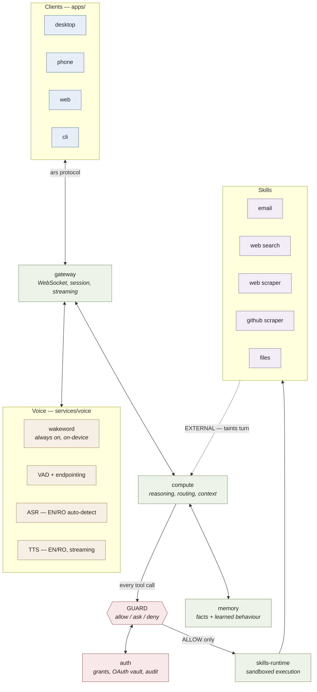

# A.R.S — architecture overview

*Last verified: 2026-09-06 against commit `initial`. Owner: `system-architect`.*

A.R.S is a **private, local-first voice and compute assistant**. It listens, speaks
English and Romanian, acts on the user's own accounts under explicit grants, searches
and scrapes the web and GitHub, and learns how the user wants it to behave by asking.

## The four constraints that drive every decision

1. **Privacy is structural, not a setting.** The default deployment runs entirely on the
   user's own hardware. Cloud backends are opt-in per capability, and `SENSITIVE` data
   never leaves the device regardless of configuration.
2. **Latency is a budget, not an aspiration.** Voice interaction dies above ~1.2 s to
   first audio. Every component is allocated a slice and must report against it.
3. **The assistant is fed hostile text.** Email and scraped pages contain instructions
   aimed at the model. Provenance and taint are enforced in the protocol itself.
4. **It runs on a phone.** Anything that cannot degrade to a constrained device is
   designed wrong. The phone may be a thin client to a home node, or fully standalone.

## Components

The dotted line is the important one: **everything a skill fetches from the outside world
re-enters the reasoning layer marked `EXTERNAL`**, which taints the turn and downgrades
what the guard will allow without asking.

## Latency budget — speech end to first audio

Target **p95 ≤ 1400 ms** on an M-series laptop for a local-model turn with no tool call.
Measured from the moment the user stops speaking, because that is the silence they feel.
Corrected in [ADR 0001](../adr/0001-endpointing-latency-budget.md) — the original table
allocated 400 ms to endpointing, which is not achievable while waiting 700 ms for silence.

| Stage | Budget (p95) | Owner |
|---|---:|---|
| Endpoint confirmation (700 ms silence + detection) | 750 ms | voice-engineer |
| ASR final (after endpoint) | 250 ms | voice-engineer |
| Context assembly + memory recall | 80 ms | backend / ml |
| LLM first token | 200 ms | ml-engineer |
| TTS time-to-first-audio | 120 ms | voice-engineer |
| **Total** | **1400 ms** | system-architect |

Wakeword detection is budgeted separately at **150 ms**: it happens before the user
speaks, so it does not sit on this path.

The endpoint row dominates and is mostly idle waiting. Overlapping ASR and LLM prefill
with the silence window takes the total to ~1050 ms; that is the next voice work item,
not a smaller silence window (ADR 0001).

A turn with a tool call gets a separate budget and **must speak a filler acknowledgement
within 600 ms** — silence while it works reads as failure.

Guard evaluation is allocated **0 ms**: it is an in-process policy check against loaded
grants, with no network call on the hot path. If it ever needs I/O, the design is wrong.

## The tier ladder — how much machine a question is worth

Most questions a personal assistant gets are lookups, and running a 14B model for a
lookup is slower than finding the passage, not faster. So a turn climbs a ladder and
stops at the first rung that answers, in `services/gateway/brain.py`:

| Tier | Answers from | Cost | Gate |
|---|---|---:|---|
| 0 `RECALL` | an answer already given to this same question | ~1 ms, no model | raw cosine ≥ 0.82 |
| 1 `DOCUMENTS` | a passage from the user's own learned files | ~10 ms, CPU only | calibrated confidence ≥ 0.85 |
| 2 `LOCAL` | the local model, on the GPU | ~4-8 s | — |
| 3 `CLOUD` | a cloud model, only if granted and not private | network | — |

The two gates are deliberately on different scales, because they ask different questions
of different populations. Tier 0 compares a question to a question ("is this the same
thing again?"); tier 1 asks whether a passage answers one. Both numbers come from
`research/benchmarks/retrieval_calibration.py`, which measures them on the real embedding
model with the same questions in English and Romanian, and refuses to emit constants when
the relevant and irrelevant populations overlap.

The percentage the interface shows is that calibration, not a raw cosine: 85% means "as
far above the noise floor as a real answer sits". Every turn reports the tier that
answered it and why, and the escalation endpoint records that a question needed a higher
tier next time — which is what actually tunes the threshold.

**The document tier was same-language, and is not any more.** A Romanian question finds a
Romanian document (measured 0.844) and an English one an English document (0.831); the
same question asked in the *other* language scored 0.778-0.817, which is the range
unrelated questions also reach. No threshold separates those, and a larger embedding model
does not help — `intfloat/multilingual-e5-base` was measured on the same fixtures and
separates cross-language matches from irrelevant ones by **-0.007**, worse than the small
model it would replace.

So the passage is bridged instead of the question. Every uploaded document is indexed in
all three languages: the copies are made in the background after the upload returns,
carry `origin_id` back to the passage they came from, and cost nothing on the hot path.
Measured on a German lease — English questions answered went from 1 of 4 to 4 of 4,
Romanian from 0 of 4 to 3 of 4, and live, a German lease now answers "How much is the rent
per month?" from the document tier at 100% in 11 ms.

Two things that had to be true first, both correctness bugs in their own right: `forget()`
follows `origin_id`, or a deleted document keeps answering through its translation; and
the ambiguity rule skips a hit's own translations, or every passage is refused for being
ambiguous with itself.

Translation quality is the model's, and it is not uniform: chrF++ runs 82 for de->en and
59 for de->ro, which is the weak leg and the first thing to re-measure if answers read
badly in Romanian.

Which model built the vector index is recorded in `memory_meta` and checked on every
open: vectors from two models are not comparable, and a silently mixed index returns the
wrong passage with high confidence. On a mismatch the store re-embeds.

## Seeing what it knows

A private assistant that learns from your files is asking for a lot of trust, and "what
does it actually know about me" should be answerable by looking rather than by opening a
database. `/api/knowledge` returns the store as a graph — documents, the passages they
were cut into, the translations derived from those passages, and the answers A.R.S has
learned — and the console draws it, growing as things arrive rather than redrawing.

A translation is an edge, not a second document, because that is what it is: the same
passage wearing another language. Language is drawn as a collar around each node, at a
different angle per language as well as a different hue, so a translated triplet is
distinguishable without relying on colour vision.

The side column is a deck — brain, documents, permissions, audit, status — rather than one
scrolling stack, and the network expands to the full window, because 340 pixels is not
enough room to read what a machine knows about you.

## Trust boundaries

| Boundary | Crossing | Enforcement |
|---|---|---|
| Microphone → system | audio | nothing leaves the device pre-wakeword |
| Skill → reasoning | fetched text | `Provenance` + `TrustLevel.EXTERNAL` |
| Reasoning → real world | tool call | `GuardEngine.evaluate` before any side effect |
| Device → cloud LLM | context | `SENSITIVE` records refused; redaction applied |
| Third-party skill → host | process | subprocess, no ambient creds, network allowlist |

## Deployment shapes

| Shape | Reasoning | Voice | Notes |
|---|---|---|---|
| **Laptop standalone** | local (Ollama) | fully local | reference deployment; no network needed |
| **Home node + phone** | on node | wake/VAD on phone, ASR/TTS on node | phone stays a thin client; battery-friendly |
| **Phone standalone** | small local model | on-device | degraded reasoning, full privacy |
| **Hybrid** | cloud for hard turns | local | opt-in per capability, `SENSITIVE` never routed out |

## Where things live

| Path | Contents |
|---|---|
| `packages/protocol` | wire contracts — **single source of truth**, no service may fork a type |
| `packages/core` | engine interfaces + config; no vendor SDK ever imported outside a backend |
| `services/voice` | wakeword, VAD, ASR, TTS |
| `services/compute` | reasoning, tool routing, context assembly, observation extraction — see [README](../../services/compute/README.md) |
| `services/memory` | facts, embeddings, learned preferences, deletion |
| `services/auth` | grants, consent, OAuth token vault, audit log |
| `services/skills-runtime` | sandboxed skill execution |
| `services/gateway` | WebSocket front door |
